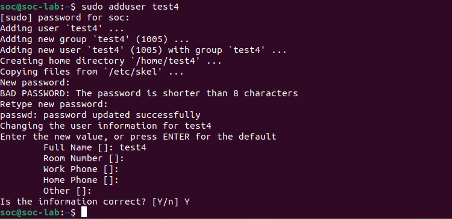
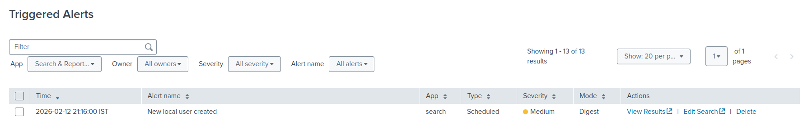
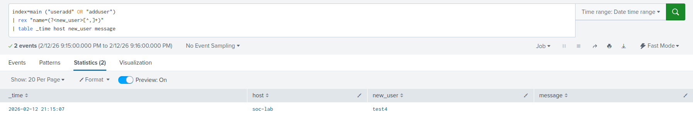

# Linux New Local User Creation Detection

## Objective
Detect the creation of new local user accounts on Linux systems, which may indicate unauthorized access, persistence attempts, or administrative activity.

## Why This Alert Matters
Attackers often create new local user accounts after gaining access to a Linux system to maintain persistence and ensure continued access.

Creating a new local user allows attackers to:

- Establish alternate login credentials
- Maintain persistence even if the original account is disabled
- Blend in with legitimate system users
- Escalate privileges if combined with sudo group assignment

Monitoring Linux user creation events provides visibility into potentially malicious account provisioning activity.

## MITRE ATT&CK Mapping
- **TA0003 – Persistence**
- **T1136.001 – Create Account: Local Account**

## Log Sources
- **Linux System Logs**
  - `/var/log/auth.log`
  - `/var/log/syslog`
- Log message patterns:
  - `useradd`
  - `adduser`

Relevant fields:
- `host`
- `new_user`
- `_time`
- `message`

## Detection Logic (High-Level)
This detection monitors Linux logs for commands related to user account creation.

It performs the following:

1. Searches for log entries containing:
   - `useradd`
   - `adduser`
2. Extracts the newly created username from the log message.
3. Displays relevant event details for investigation.

This activity may indicate legitimate system administration or potential attacker persistence behavior.

## Trigger Condition
- **Alert type:** Scheduled  
- **Schedule:** Every 1 minute (`*/1 * * * *`)  
- **Time range:** Last 1 minute  
- **Trigger when:** Number of results > 0  
- **Trigger frequency:** Once  
- **Throttle:** 60 seconds  

**Reasoning:**  
Local user creation is a security-sensitive event. Triggering on any occurrence ensures timely investigation while preventing duplicate alerts through throttling.

## Attack Simulation
The alert was validated by manually creating a new local user on the Linux system.

Command used:

```bash
sudo adduser test4
```


This generated log entries containing `adduser`, which were ingested into Splunk and successfully detected by the alert.

## Validation
- The alert triggered immediately after user creation.
- SPL results confirmed:
  - Host system
  - Newly created username
  - Associated log message
- Raw system logs were reviewed to verify accuracy.

### Alert & Detection Output




Evidence is available in the `Screenshots/` directory.

## False Positive Considerations
- Legitimate administrative account provisioning
- System onboarding processes
- Automated deployment scripts

Environment-specific tuning may include:
- Monitoring only non-standard account names
- Alerting outside approved maintenance windows

## SOC Response Actions
1. Verify whether the account creation was authorized  
2. Confirm the business justification for the new user  
3. Identify the administrator responsible for the action  
4. Check whether the new account has sudo privileges  
5. Review recent login activity for the account  
6. Disable unauthorized accounts if required  
7. Escalate to incident response if malicious activity is suspected  
