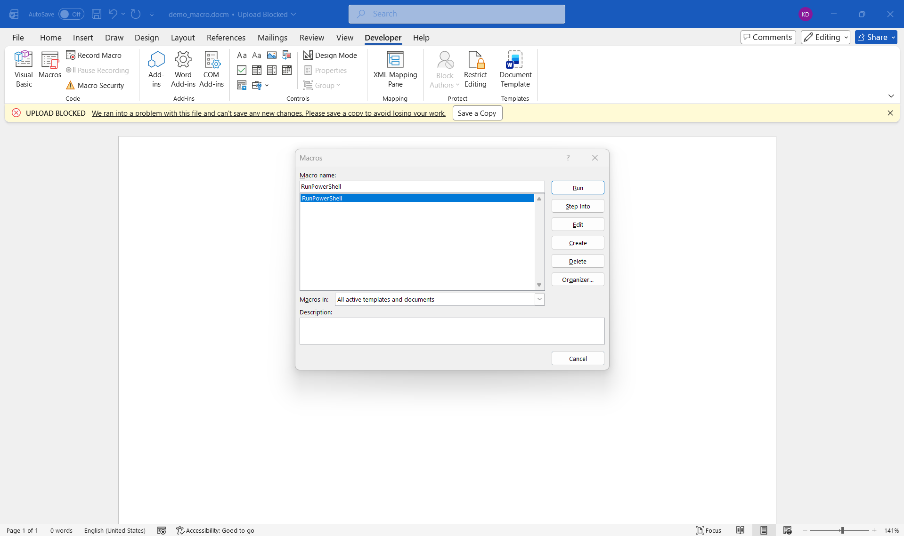
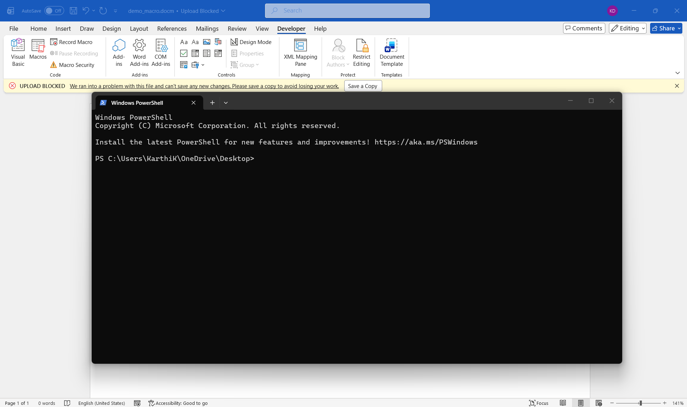
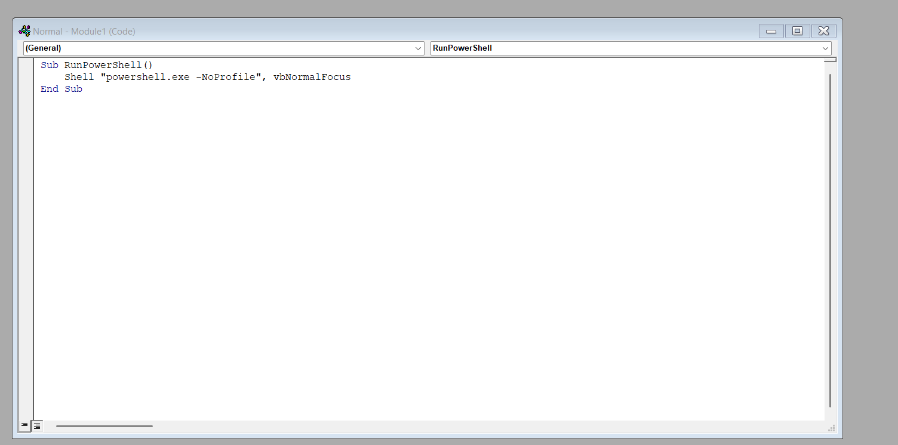
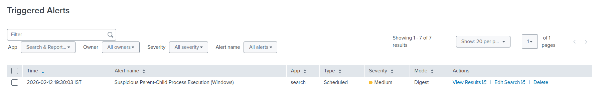
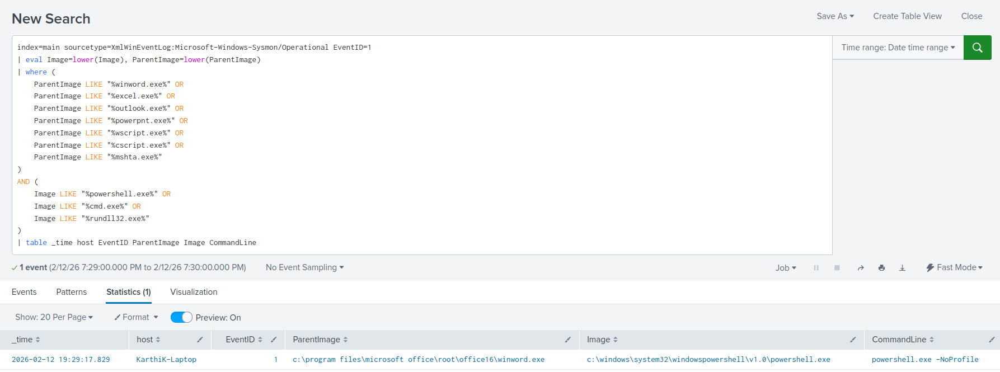

# Suspicious Parent-Child Process Execution (Windows)

## Objective
Detect suspicious parent-child process relationships on Windows systems that may indicate malicious macro execution, script abuse, or post-exploitation activity.

## Why This Alert Matters
Attackers frequently abuse trusted applications such as Microsoft Office to execute malicious payloads. One common technique involves embedding macros in Word or Excel documents that spawn command interpreters such as PowerShell or CMD.

Legitimate Office applications rarely spawn command-line interpreters directly. When such behavior occurs, it often indicates:

- Malicious macro execution
- Phishing-based initial access
- Script-based payload delivery
- Living-off-the-Land binary (LOLBins) abuse

Monitoring abnormal parent-child process relationships provides strong behavioral detection against macro-based attacks.

## MITRE ATT&CK Mapping
- **TA0001 – Initial Access**
- **TA0002 – Execution**
- **TA0005 – Defense Evasion**
- **T1204.002 – User Execution: Malicious File**
- **T1059.001 – Command and Scripting Interpreter: PowerShell**

## Log Sources
- **Sysmon Operational Log**
- **Event ID 1 – Process Create**
- Splunk sourcetype: `XmlWinEventLog:Microsoft-Windows-Sysmon/Operational`

Relevant fields:
- `ParentImage`
- `Image`
- `CommandLine`
- `host`
- `_time`

## Detection Logic (High-Level)
This detection monitors Sysmon process creation events for suspicious parent-child relationships.

It identifies cases where:

### Suspicious Parent Processes:
- `winword.exe`
- `excel.exe`
- `outlook.exe`
- `powerpnt.exe`
- `wscript.exe`
- `cscript.exe`
- `mshta.exe`

AND

### Suspicious Child Processes:
- `powershell.exe`
- `cmd.exe`
- `rundll32.exe`

Such process chains are commonly associated with malicious document execution and script-based attacks.
## Trigger Condition
- **Alert type:** Scheduled  
- **Schedule:** Every 1 minute (`*/1 * * * *`)  
- **Time range:** Last 1 minute  
- **Trigger when:** Number of results > 0  
- **Trigger frequency:** Once  
- **Throttle:** Enabled  

**Reasoning:**  
Office applications spawning command interpreters is uncommon in normal enterprise usage. Triggering on any occurrence ensures rapid detection of macro-based or script-based attacks.

## Attack Simulation
The alert was validated using a malicious Microsoft Word macro that launches PowerShell.

Macro used:

```vba
Sub RunPowerShell()
    Shell "powershell.exe -NoProfile", vbNormalFocus
End Sub
```

When the macro was executed:

- `winword.exe` spawned `powershell.exe`
- Sysmon generated Event ID 1
- The event was ingested into Splunk
- The alert successfully triggered






## Validation
- The alert triggered immediately after macro execution.
- SPL results confirmed:
  - Parent process: winword.exe
  - Child process: powershell.exe
  - Associated command line
- Raw Sysmon logs were reviewed to verify process relationship accuracy.

### Alert & Detection Output




Evidence is available in the `Screenshots/` directory.

## False Positive Considerations
- Administrative automation using Office-integrated scripts
- Developer environments testing macro functionality
- Internal IT scripting workflows

Environment-specific tuning may involve:
- Whitelisting known internal automation scripts
- Filtering trusted parent-child combinations

## SOC Response Actions
1. Identify the source document executed by the user  
2. Determine whether the document originated from email or external download  
3. Inspect the macro content for malicious behavior  
4. Analyze the spawned command for additional payload execution  
5. Check for further lateral movement or persistence mechanisms  
6. Isolate the endpoint if malicious behavior is confirmed  
7. Initiate phishing containment procedures if required  
