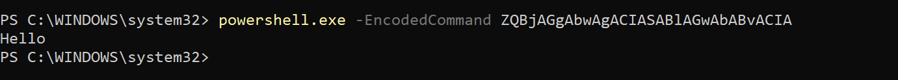
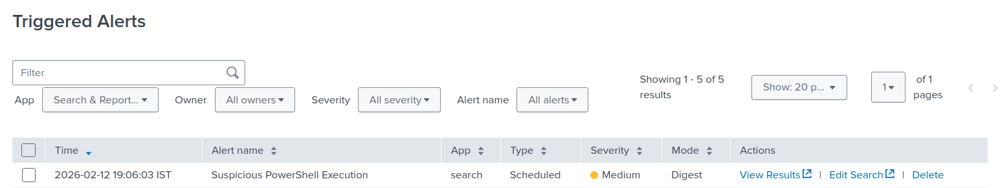
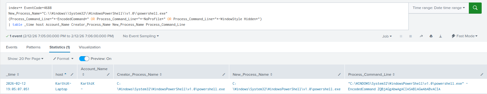

# Suspicious PowerShell Execution Detection

## Objective
Detect suspicious execution of PowerShell using encoded commands, which may indicate obfuscation, fileless malware activity, or post-exploitation behavior on a Windows endpoint.

## Why This Alert Matters
PowerShell is a legitimate administrative tool, but it is also heavily abused by attackers for execution, lateral movement, payload delivery, and persistence.

The use of the `-EncodedCommand` parameter allows attackers to:

- Obfuscate malicious commands  
- Bypass simple command-line monitoring  
- Execute fileless payloads directly in memory  
- Evade basic detection mechanisms  

Monitoring encoded PowerShell execution provides early visibility into potentially malicious activity during the execution and defense evasion phases of an attack.

## MITRE ATT&CK Mapping
- **TA0002 – Execution**
- **TA0005 – Defense Evasion**
- **T1059.001 – Command and Scripting Interpreter: PowerShell**

## Log Sources
- **Windows Security Event Log**
- **Event ID 4688 – A new process has been created**
- Process creation auditing enabled
- Relevant fields:
  - `New_Process_Name`
  - `Process_Command_Line`
  - `Creator_Process_Name`
  - `Account_Name`

## Detection Logic (High-Level)
This detection monitors Windows Security logs for process creation events where:

- The newly created process is `powershell.exe`
- The command line contains the `-EncodedCommand` parameter

Encoded PowerShell commands are commonly used to conceal malicious scripts by encoding them in Base64 format before execution.

The detection extracts relevant execution metadata for investigation, including:

- Host
- User account
- Parent process
- Full command line
## Trigger Condition
- **Alert type:** Scheduled  
- **Schedule:** Every 1 minute (`*/1 * * * *`)  
- **Time range:** Last 1 minute  
- **Trigger when:** Number of results > 0  
- **Trigger frequency:** Once  
- **Throttle:** 60 seconds  

**Reasoning:**  
Encoded PowerShell execution is not typical for standard user activity. Triggering on any occurrence ensures rapid detection of potentially malicious behavior while throttling prevents duplicate alerts within short time windows.

## Attack Simulation
The alert was validated by manually executing an encoded PowerShell command on the endpoint.

Command used:

```powershell
powershell.exe -EncodedCommand ZQBjAGgAbwAgACIASABlAGwAbABvACIA
```

This command executes a Base64-encoded PowerShell payload.




The execution generated Event ID 4688 in the Windows Security logs, which was successfully ingested and detected by Splunk.

## Validation
- The alert triggered immediately upon encoded PowerShell execution.
- SPL results confirmed:
  - PowerShell process creation  
  - Encoded command usage  
  - Executing user account  
- Raw Security logs were reviewed to verify accuracy.

### Alert & Detection Output




Relevant evidence is available in the `Screenshots/` directory.

## False Positive Considerations
- Administrative automation scripts using encoded commands  
- Software deployment tools leveraging encoded PowerShell  
- Security or monitoring agents  

Environment-specific tuning may be required to whitelist trusted automation accounts or known management systems.

## SOC Response Actions
1. Decode the Base64 command to determine its true intent  
2. Review the parent process for suspicious spawning behavior  
3. Validate the executing user account  
4. Check for additional suspicious activity on the host  
5. Assess whether the command performed persistence or lateral movement  
6. Contain the endpoint if malicious behavior is confirmed  
7. Initiate deeper forensic investigation if required  
