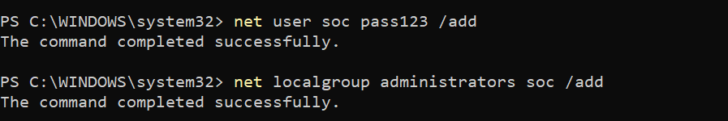
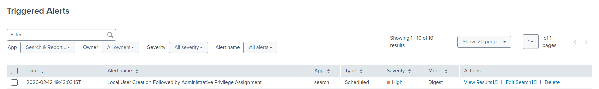
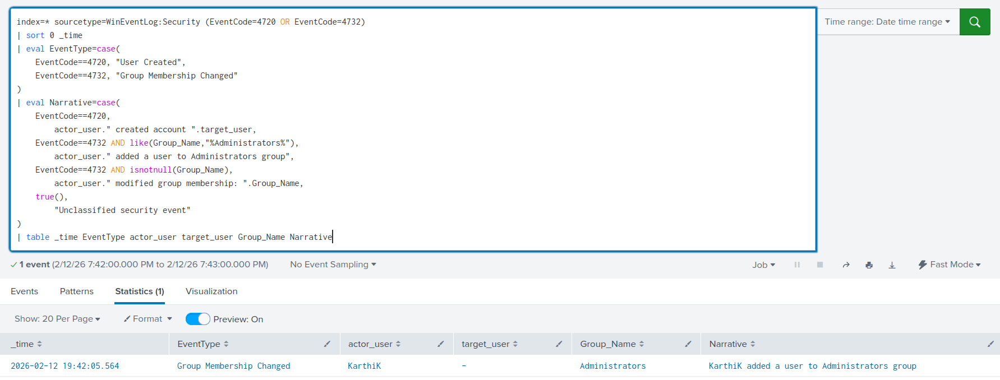

# User Added to Administrators Group Detection

## Objective
Detect when a user account is added to the local Administrators group on a Windows system, which may indicate privilege escalation or unauthorized access.

## Why This Alert Matters
Adding a user to the local Administrators group grants elevated privileges on the system.

Attackers frequently perform this action after gaining access to:

- Escalate privileges
- Maintain persistence
- Enable lateral movement
- Ensure long-term control over the system

This action significantly increases the impact of a compromise and should be treated as a high-risk security event.

## MITRE ATT&CK Mapping
- **TA0003 – Persistence**
- **TA0004 – Privilege Escalation**
- **T1098 – Account Manipulation**

## Log Sources
- **Windows Security Event Log**
- **Event ID 4732 – A member was added to a security-enabled local group**
- Splunk sourcetype: `WinEventLog:Security`

Relevant fields:
- `actor_user`
- `target_user`
- `Group_Name`
- `_time`

## Detection Logic (High-Level)
This detection monitors Windows Security logs for Event ID 4732.

It specifically identifies cases where:

- A user account is added to the **Administrators** group.

The detection extracts:

- The account performing the action
- The affected group
- Event timestamp

This provides immediate visibility into administrative privilege assignment.
## Trigger Condition
- **Alert type:** Scheduled  
- **Schedule:** Every 1 minute (`*/1 * * * *`)  
- **Time range:** Last 1 minute  
- **Trigger when:** Number of results > 0  
- **Trigger frequency:** Once  
- **Throttle:** 60 seconds  

**Reasoning:**  
Administrative group membership changes are high-impact events. Triggering on any occurrence ensures rapid investigation and containment.

## Attack Simulation
The alert was validated by manually adding a user to the local Administrators group.

Commands used:

```powershell
net user soc pass123 /add
net localgroup administrators soc /add
```

The second command generated Event ID 4732 in the Windows Security logs.

The event was successfully ingested into Splunk and detected by the alert.

## Validation
- The alert triggered immediately after the user was added to the Administrators group.
- SPL results confirmed:
  - Actor account
  - Target user
  - Group name: Administrators
- Raw Security logs were reviewed to verify event accuracy.

### Alert & Detection Output

02_alert_triggered.png    
03_detection_result.png   
Evidence is available in the `Screenshots/` directory.

## False Positive Considerations
- Legitimate administrative onboarding
- IT account provisioning
- System configuration changes during maintenance

Environment-specific tuning may include:
- Monitoring only non-approved administrative accounts
- Alerting only outside change windows

## SOC Response Actions
1. Verify whether the privilege assignment was authorized  
2. Confirm business justification for administrative access  
3. Identify the originating system and responsible user  
4. Check for additional suspicious activity on the endpoint  
5. Remove unauthorized administrative access if required  
6. Reset credentials if compromise is suspected  
7. Escalate to incident response if malicious intent is confirmed  
