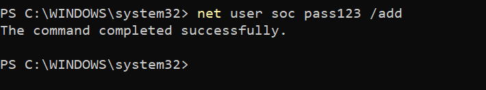
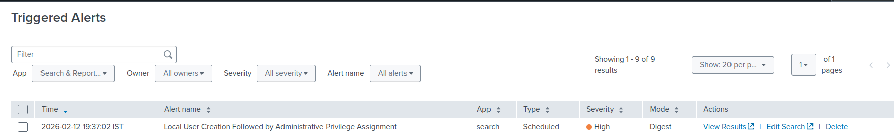
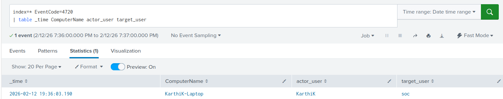

# Windows Local User Creation Detection

## Objective
Detect the creation of new local user accounts on Windows systems, which may indicate unauthorized access, persistence attempts, or account provisioning activity.

## Why This Alert Matters
Attackers frequently create new local user accounts after gaining access to a system. This allows them to:

- Maintain persistence
- Establish alternate access paths
- Avoid detection if the original compromised account is disabled
- Blend into legitimate system users

While local user creation can be legitimate, it is a sensitive security event that requires visibility and validation.

Monitoring new account creation helps identify early stages of persistence or unauthorized administrative activity.

## MITRE ATT&CK Mapping
- **TA0003 – Persistence**
- **T1136.001 – Create Account: Local Account**

## Log Sources
- **Windows Security Event Log**
- **Event ID 4720 – A user account was created**
- Splunk sourcetype: `WinEventLog:Security`

Relevant fields:
- `actor_user`
- `target_user`
- `_time`

## Detection Logic (High-Level)
This detection monitors Windows Security logs for Event ID 4720, which indicates that a new user account has been created on the system.

The detection extracts:

- The account responsible for creating the user
- The newly created user account
- Event timestamp

This provides immediate visibility into account provisioning activity.
## Trigger Condition
- **Alert type:** Scheduled  
- **Schedule:** Every 1 minute (`*/1 * * * *`)  
- **Time range:** Last 1 minute  
- **Trigger when:** Number of results > 0  
- **Trigger frequency:** Once  
- **Throttle:** 60 seconds  

**Reasoning:**  
User account creation is a low-frequency but security-sensitive event. Triggering on any occurrence ensures timely investigation while throttling prevents duplicate alerts.

## Attack Simulation
The alert was validated by manually creating a new local user account.

Command used:

```powershell
net user soc pass123 /add
```



This action generated Event ID 4720 in the Windows Security logs, which was successfully ingested and detected by Splunk.

## Validation
- The alert triggered immediately after account creation.
- SPL results confirmed:
  - Actor account
  - Newly created user account
- Raw Security logs were reviewed to verify event accuracy.

### Alert & Detection Output



Evidence is available in the `Screenshots/` directory.

## False Positive Considerations
- Legitimate administrative account provisioning
- IT onboarding processes
- Automated deployment scripts

Environment-specific tuning may include monitoring account naming patterns or excluding trusted provisioning systems.

## SOC Response Actions
1. Verify whether the account creation was authorized  
2. Confirm the business justification for the new account  
3. Identify the originating system and responsible user  
4. Check for additional suspicious activity on the endpoint  
5. Disable unauthorized accounts if required  
6. Escalate to incident response if malicious behavior is confirmed  
